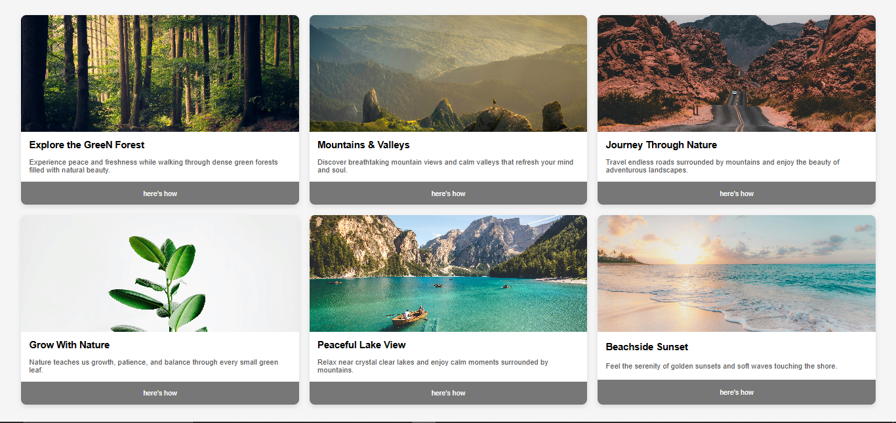

# 🌿 Nature Explorer UI (Card Layout Project)

A modern and responsive **Nature Explorer Card UI** built using **HTML5 and CSS3**.  
This project showcases a clean card-based layout with beautiful nature images and call-to-action buttons.

---

## 🚀 Features

- 🖼️ Beautiful Nature Image Cards
- 📦 Responsive Card Grid Layout
- 🎨 Modern UI Design
- 🌫️ Soft Shadows & Rounded Corners
- 🖱️ Hover Effects
- 📱 Responsive Structure

---

## 🛠️ Tech Stack

- HTML5
- CSS3
- Flexbox / Grid Layout
- Box Shadow
- Border Radius

---

## 📂 Project Structure

Nature-Explorer/
│── index.html  
│── style.css  
│── images/

---

## 🎨 UI Sections

### 🔹 Card Components

Each card includes:

- High-quality background image
- Title heading
- Description text
- Call-to-action button

### 🔹 Layout Design

- 3-column responsive grid
- Even spacing between cards
- Clean typography
- Soft shadow effects for depth

---

## 💡 Key CSS Concepts Used

- Flexbox / Grid system
- Box-shadow for elevation effect
- Border-radius for modern design
- Responsive width handling
- Typography styling
- Button styling

---

## 🧠 What I Learned

- Designing modern card layouts
- Working with responsive grids
- Improving UI aesthetics
- Using shadows for depth
- Structuring reusable components

---

## 🔮 Future Improvements

- 🌙 Add Dark Mode
- 🎞️ Add hover animation effects
- 📱 Improve full mobile responsiveness
- 🔗 Make buttons functional
- 🧩 Convert into reusable React component

---

## 📸 Screenshot

## 

## ⚠️ Disclaimer

This project is created for learning and UI practice purposes only.

---

## 👨‍💻 Author

**Harshit Vishwakarma**  
B.Tech Student | Frontend Developer 🚀

---

⭐ If you like this project, give it a star!
